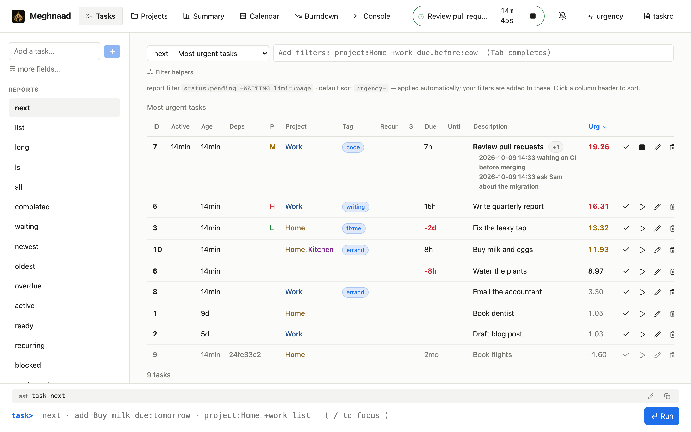
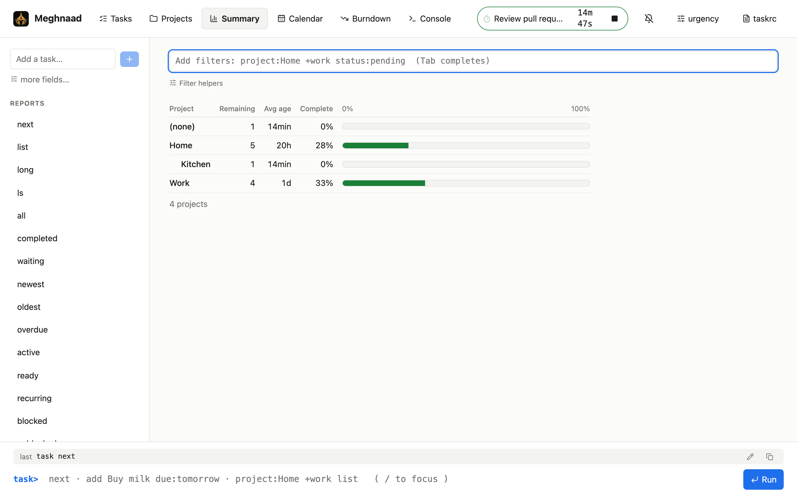
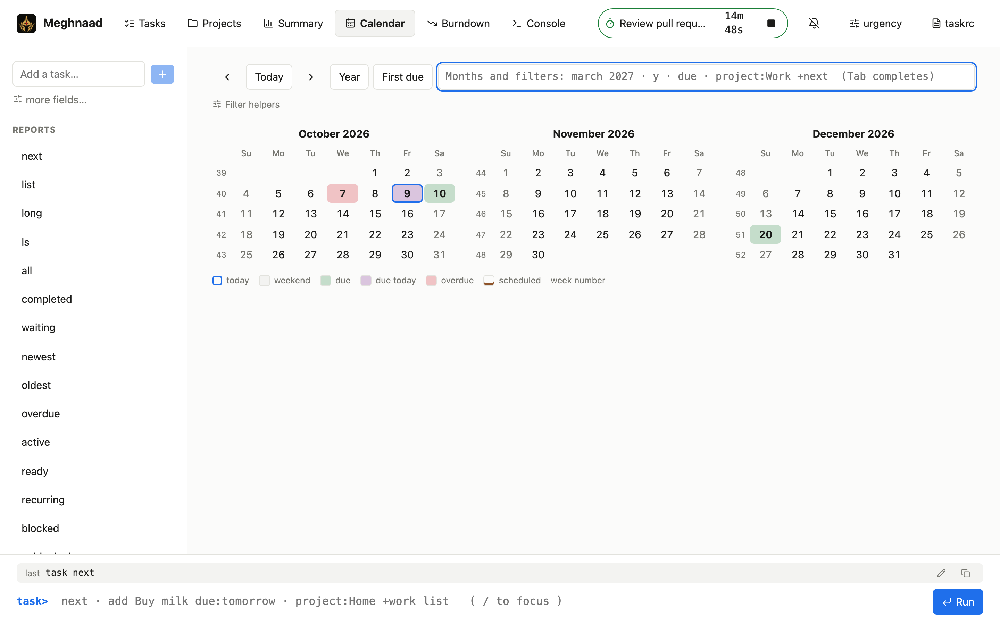
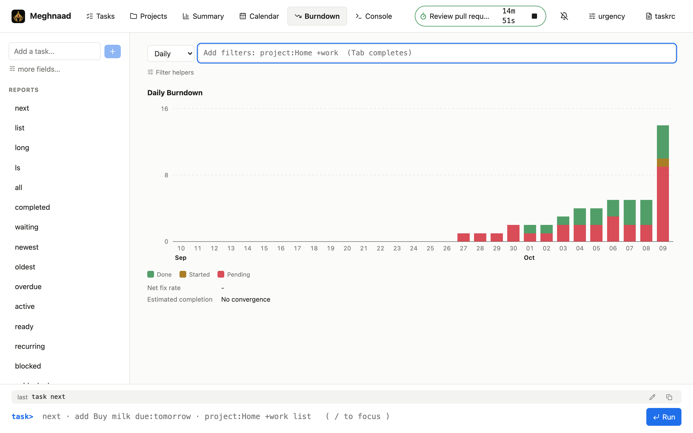
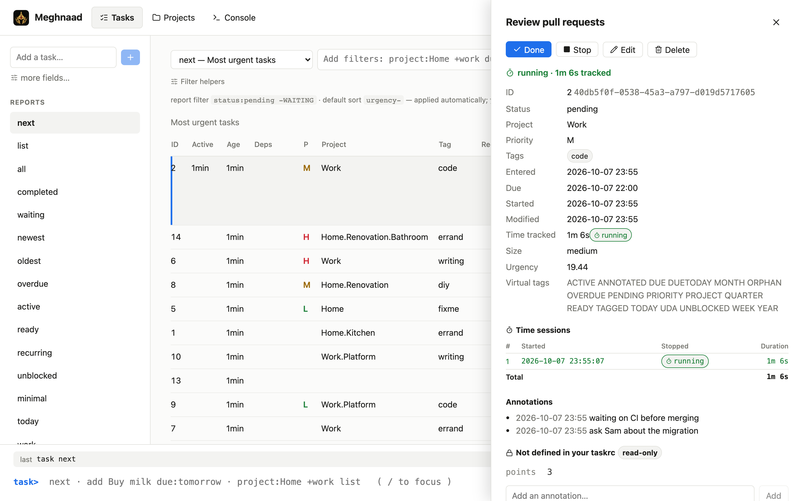
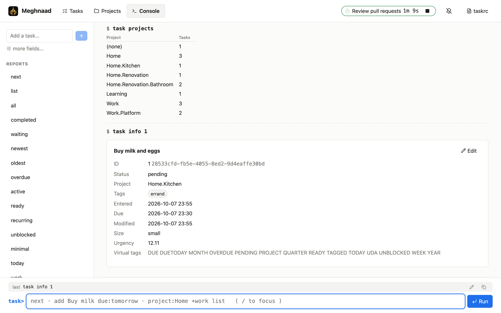
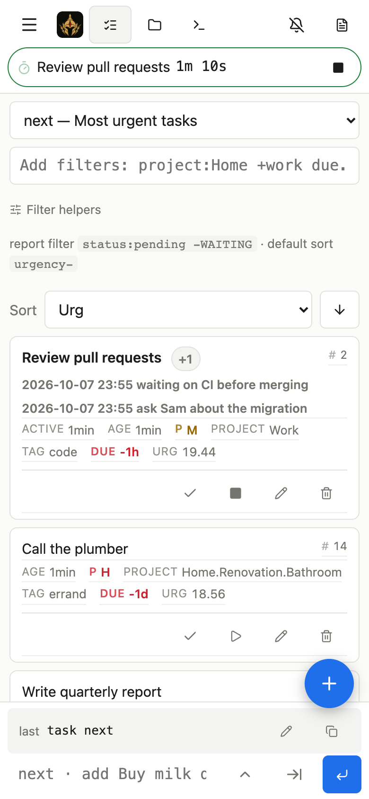
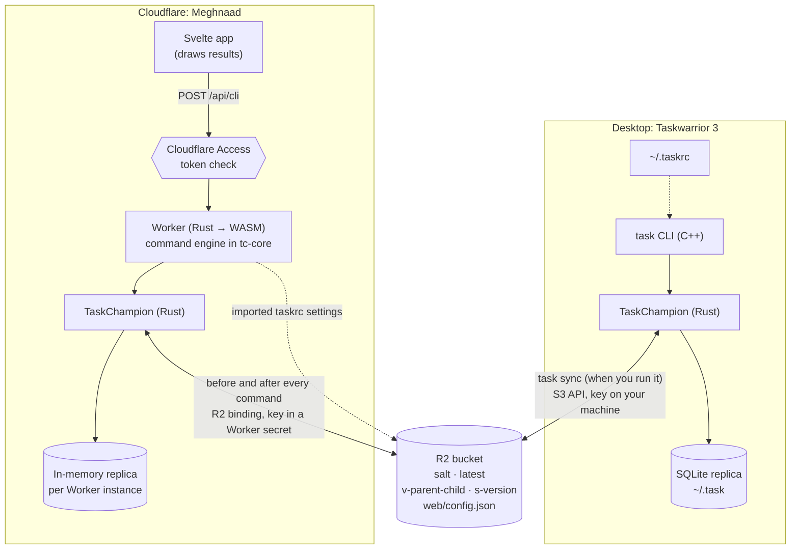

<p align="center">
  
</p>

<h1 align="center">Meghnaad</h1>

<p align="center">
  <a href="https://taskwarrior.org">Taskwarrior 3</a> in your browser. Runs on Cloudflare: a Rust Worker,
  your existing R2 bucket as the sync store, and Cloudflare Access for login.
</p>

---

Meghnaad is another **replica** of your Taskwarrior data. Your `task` CLI keeps syncing to R2 exactly as it does today;
this app reads and writes the same bucket, so a task added in the browser shows up on your laptop after `task sync`,
and the other way round. It is **console-first** (type `task`-style commands) with a normal interface beside it
(tables, forms, charts), and both go through the same command engine.

- **Works with the bucket you already have.** Point it at the R2 bucket your `task` already syncs to and give it the same
  encryption secret. No migration, no new server, nothing changes for the CLI.
- **Taskwarrior's behaviour, not an imitation of it.** Filters, virtual tags, urgency, report sorting, recurrence,
  regular expressions, the calendar, `summary`, `burndown`, `calc` and the confirmations are ported from Taskwarrior's
  source and checked against the real `task` 3.5.0.
- **Taskwarrior 3.5.0 and newer.** Settings removed or deprecated before it are not supported.
- **Your `taskrc`, safely.** Import your UDAs, custom reports, contexts and settings. Sync settings and anything that
  looks like a credential are blocked. See [taskrc support](docs/taskrc-support.md) for what is and isn't read.
- **Built for a phone as well as a desk**, with time tracking, reminders and a console with completion.

> **Status.** Verified end to end against the released `task` 3.5.0 using a local S3-compatible server (both
> directions: tasks, UDAs, reports, recurring series, snapshots), and in use against a real R2 bucket.

<p align="center">
  
</p>

<table>
  <tr>
    <td width="50%"></td>
    <td width="50%"></td>
  </tr>
  <tr>
    <td align="center"><sub>Summary: how far along each project is</sub></td>
    <td align="center"><sub>Calendar: click a day to see what is due</sub></td>
  </tr>
  <tr>
    <td></td>
    <td></td>
  </tr>
  <tr>
    <td align="center"><sub>Burndown, drawn the way <code>task burndown</code> counts</sub></td>
    <td align="center"><sub>Task detail: time tracking, annotations, history</sub></td>
  </tr>
  <tr>
    <td></td>
    <td align="center"></td>
  </tr>
  <tr>
    <td align="center"><sub>The console. Taskwarrior's yes/no/all/quit becomes a table of ticks</sub></td>
    <td align="center"><sub>On a phone</sub></td>
  </tr>
</table>

## Documentation

| | |
| --- | --- |
| **[Using Meghnaad](docs/using.md)** | The pages, the console, Taskwarrior's questions, recurring tasks, urgency, time tracking, the phone layout |
| **[Deploying](docs/deploy.md)** | Plans you need, the guided setup, Cloudflare Access, connecting your `task` CLI, configuration, fixing problems |
| **[Architecture](docs/architecture.md)** | How it works, the engine, sync, platform limits, how correctness is kept |
| **[taskrc support](docs/taskrc-support.md)** | Every Taskwarrior `taskrc` option: done, partial, not done, not applicable |

## How it works



- **The bucket** holds Taskwarrior's standard TaskChampion cloud layout, encrypted client-side. The Worker implements
  the same protocol, so it and the CLI are interchangeable replicas.
- **The Worker** keeps an in-memory replica and syncs before and after every command; an idle sync is one read. A
  Worker that has been quiet rebuilds from the newest snapshot, which it writes now and then like the CLI does.
- **One endpoint**, `POST /api/cli`, takes what you typed or what a button sends, so Taskwarrior's rules live in one
  place: the `tc-core` crate. The browser draws results and holds nothing.
- **Your imported taskrc settings** are stored in the same bucket, so they survive restarts and follow you between
  devices.

|  | Desktop Taskwarrior | Meghnaad |
| --- | --- | --- |
| Local state | Persistent SQLite | In memory, rebuilt from the bucket when the instance is recycled |
| Sync | When you run `task sync` | Before and after every command |
| Offline | Works | Needs a connection |
| Encryption key | Only on your machine | In a Worker secret; the Worker decrypts |
| Task ids | Local to that replica | Computed separately, so they differ |
| Hooks | `on-add`, `on-modify` | None |

More in [Architecture](docs/architecture.md).

## Quick start (local)

You can run everything on your machine without a Cloudflare account; wrangler simulates R2.

**Prerequisites:** [Rust](https://rustup.rs) 1.91+ and Node.js 20+. The build installs the `wasm32-unknown-unknown`
target and `worker-build` if they're missing.

```bash
git clone <this repo> && cd Meghnaad
npm install                      # one install covers the Worker tooling and the Svelte app
cp .dev.vars.example .dev.vars   # local-only secret + Access bypass
npm run dev                      # builds the web app and the Worker, then serves everything
```

The first run compiles the Worker to WASM (about a minute); after that it rebuilds when you edit `crates/`. Open
**http://127.0.0.1:8787**. For a hot-reloading UI run `npm --prefix web run dev` in a second terminal, and for demo data
run `./scripts/seed-dev.sh`. Local R2 data lives in `.wrangler/state`; delete it to start over. `DEV_AUTH_BYPASS=1` in
`.dev.vars` makes the local server skip the Access check.

## Deploy to Cloudflare

You need **Workers Paid** (the Worker's first request after a quiet spell computes more than the free plan's 10 ms CPU
limit allows), plus R2 and Access, which are fine on free plans.

```bash
npm install
npm run setup        # guided: bucket, domain, secret, Access; safe to repeat
npm run deploy       # whenever you update the code
```

Setup asks for your existing sync bucket and encryption secret, deploys, and tells you exactly what to click to connect
Cloudflare Access. Until then the app shows a setup page and nothing is reachable. The dashboard and by-hand routes,
and how to point your `task` CLI at R2 (`AWS_ENDPOINT_URL` and a few `task config` lines), are in
**[Deploying](docs/deploy.md)**.

## Using it

The header has **Tasks**, **Projects**, **Summary**, **Calendar**, **Burndown** and **Console**. Anything you can click
you can type:

```
project:Home +errand due.before:eow list
add Pay rent project:Home due:eom +bills
3 modify due:2026-12-25T08:30 priority:H
3 done            3 delete            undo
calc 2 days + 3 hours
show weekstart     config weekstart monday   (Console only)
```

A report typed in the Console prints there; typed elsewhere it opens in Tasks. Taskwarrior's confirmations (deleting,
changes to many tasks, a command with no filter, breaking a dependency chain) arrive as a table of ticks. See
**[Using Meghnaad](docs/using.md)** for the rest.

## Security

- **Login** is Cloudflare Access. The Worker independently validates the `Cf-Access-Jwt-Assertion` token on every
  `/api/*` request (RS256 signature against your team's keys, issuer, audience, expiry, not-before) and refuses forged,
  `alg: none` and cookie-only tokens. Misconfiguration means `403`, never open. `npm run test:auth` proves it against a
  mock Access.
- **Cross-site requests:** writes whose `Origin` isn't this site are refused, API responses are `no-store`, and the app
  shell carries a strict Content-Security-Policy.
- **Encryption** is TaskChampion's (PBKDF2-HMAC-SHA256, then ChaCha20-Poly1305). The Worker holds the secret to decrypt
  on your behalf, a deliberate trade-off: whoever can read Worker secrets in your Cloudflare account can read your tasks.
  It is not end-to-end encrypted from Cloudflare. The R2 token on your machines is separate from the Worker, which uses a
  binding and holds no token.
- **The taskrc importer** never stores, logs or returns sync or credential values; tests feed it a file full of secrets
  and assert none appear anywhere.

## Development

```
crates/tc-core/   the engine: protocol, crypto, filters, reports, commands, taskrc  (pure Rust)
crates/worker/    the Cloudflare Worker: routes, Access check, R2 store, per-instance session
web/              the Svelte 5 app (Vite)
scripts/          setup / deploy / build · seed-dev.sh (demo data) · interop-local.sh (real-CLI regression)
docs/             the guides above
```

```bash
npm test                      # cargo test + the web unit tests + the deploy-script tests
npm run check                 # svelte-check (types, accessibility)
npm run test:auth             # Cloudflare Access: forged, expired, wrong-audience tokens... all refused
./scripts/interop-local.sh    # real `task` ⇄ the Worker against one local S3 bucket, both directions
```

`interop-local.sh` needs `task`, the `aws` CLI, `sqlite3`, a built Worker and a local S3-compatible server that enforces
conditional writes, for example `docker run -d --name tw-s3 -p 18333:8333 chrislusf/seaweedfs server -s3 -dir=/data`.
It is self-contained and does not touch a dev server you have running.

**Taskwarrior's behaviour is ported from its source and checked against the real `task`**, so when changing filters,
sorting, urgency, dates or confirmations, read the C++ first and compare. [Architecture](docs/architecture.md) explains
the method and the test layers.

## Troubleshooting

The common ones are in [Deploying](docs/deploy.md#troubleshooting-a-deployment). The one worth knowing here:
**Cloudflare error 1102** ("Worker exceeded resource limits"), usually on the first request after a quiet spell, is the
CPU limit; use Workers Paid. The app retries read-only requests once on its own.

## Known limitations

- **Single user:** one set of settings and one shared replica per Worker instance.
- **Old versions** (older than about 180 days, covered by a snapshot) are not deleted by the app; the CLI does that.
- **`undo`** is kept in the Worker instance's memory and forgotten when it is recycled.
- **Dates you type** are read in your `dateformat` first, then as ISO or words (`friday`, `3d`). ISO week and ordinal
  dates (`2026-W52`) aren't understood.
- **Not every `taskrc` option applies.** Terminal, colour and local-file options don't make sense in a web app, and
  `include` and `purge.on-sync` aren't supported. See [taskrc support](docs/taskrc-support.md).
- **Phone layout** was verified in an emulated phone browser; try it on your own device.

## About the name

<p align="center">
  
</p>

Meghnaad is the warrior of the Ramayana who fought from behind the clouds. This app is Taskwarrior (the warrior)
running on Cloudflare (the cloud), with Cloudflare Access as the cover.

## License

[MIT](LICENSE) © 2026 Utsob Roy
