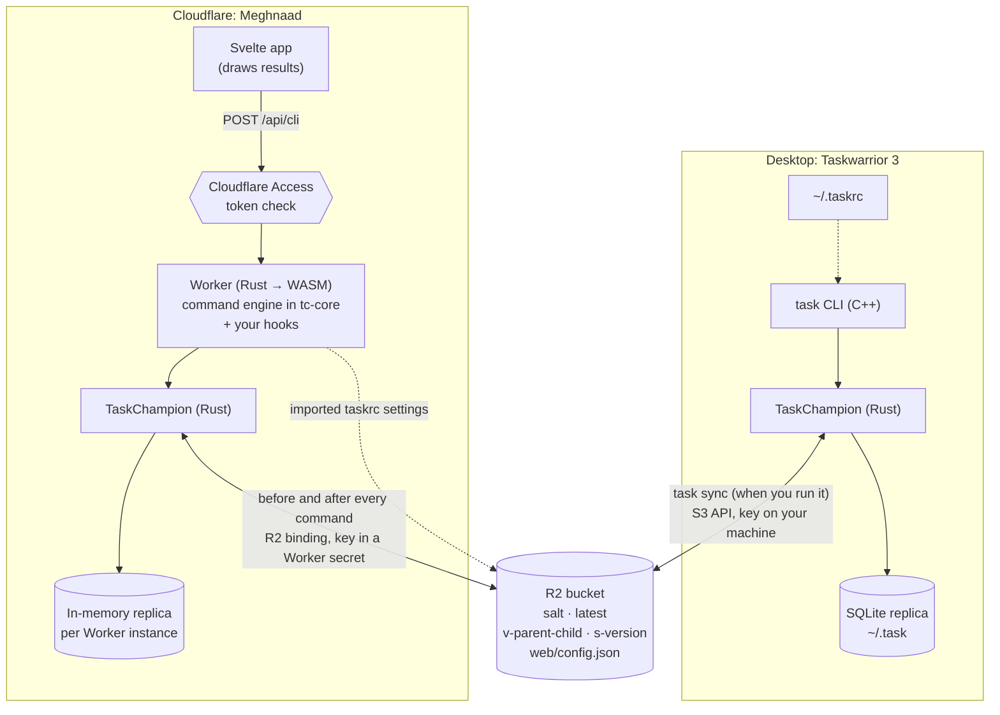

<p align="center">
  
</p>

<h1 align="center">Meghnaad</h1>

<p align="center">
  <a href="https://taskwarrior.org">Taskwarrior 3</a> in your browser. A Rust Worker on Cloudflare, your existing R2
  bucket as the sync store, Cloudflare Access for login.
</p>

---

Meghnaad is another **replica** of your Taskwarrior data. The `task` CLI keeps syncing to R2 as it does today; this app
reads and writes the same bucket. A task added here shows up on your laptop after `task sync`, and the other way round.
It is **console-first** (type `task` commands) with tables, forms and charts beside it. Both use the same command engine.

- **Uses your existing bucket.** Same R2 bucket, same encryption secret. No migration, no new server, nothing changes
  for the CLI.
- **Taskwarrior's behaviour, not an imitation.** Filters, virtual tags, urgency, reports, recurrence, regexes, the
  calendar, `summary`, `burndown`, `history`, `timesheet`, `stats`, `export`, `import`, `purge`, `duplicate`, `context`,
  `calc` and the confirmations are ported from the source and checked against the real `task` 3.5.0. Settings removed
  before 3.5.0 are not supported.
- **Your `taskrc`, safely.** Import UDAs, reports, contexts and settings. Sync settings and credentials are blocked
  ([what is read](docs/taskrc-support.md)).
- **Colours as on the desktop.** `color.*` rules, precedence and themes, drawn softly, plus a default theme of its own.
- **Hooks, as Rust.** `on-add`, `on-modify`, `on-launch` and `on-exit` become functions you deploy with the Worker
  ([Hooks](#hooks)).
- **Works on a phone**, with time tracking, reminders and a console with completion.

> **Status.** Verified against the released `task` 3.5.0 on a local S3-compatible server, in both directions (tasks,
> UDAs, reports, recurring series, snapshots, purge, import), and in use on a real R2 bucket.

<p align="center">
  
</p>

<table>
  <tr>
    <td width="50%"></td>
    <td width="50%"></td>
  </tr>
  <tr>
    <td align="center"><sub>Summary: how far along each project is</sub></td>
    <td align="center"><sub>Calendar: click a day to see what is due</sub></td>
  </tr>
  <tr>
    <td></td>
    <td></td>
  </tr>
  <tr>
    <td align="center"><sub>Burndown, drawn the way <code>task burndown</code> counts</sub></td>
    <td align="center"><sub>Task detail: time tracking, annotations, history</sub></td>
  </tr>
  <tr>
    <td></td>
    <td align="center"></td>
  </tr>
  <tr>
    <td align="center"><sub>The console. Taskwarrior's yes/no/all/quit becomes a table of ticks</sub></td>
    <td align="center"><sub>On a phone</sub></td>
  </tr>
</table>

## Documentation

| | |
| --- | --- |
| **[Using Meghnaad](docs/using.md)** | Pages, console, confirmations, hooks, recurrence, urgency, time tracking |
| **[Deploying](docs/deploy.md)** | Setup, GitHub Actions deploy, Access, connecting `task`, troubleshooting |
| **[Architecture](docs/architecture.md)** | The engine, sync, platform limits, how correctness is kept |
| **[taskrc support](docs/taskrc-support.md)** | Every `taskrc` option: done, partial, not done |

## How it works



- **The bucket** holds TaskChampion's standard cloud layout, encrypted client-side. The Worker speaks the same protocol,
  so it and the CLI are interchangeable replicas.
- **The Worker** keeps an in-memory replica and syncs before and after every command (an idle sync is one read). After a
  quiet spell it rebuilds from the newest snapshot.
- **One endpoint**, `POST /api/cli`, takes what you type or click, so Taskwarrior's rules live in one place, `tc-core`.
  The browser only draws. (`POST /api/import` carries a file's text.)
- **Imported taskrc settings** are stored in the bucket, so they survive restarts and follow you between devices.

|  | Desktop Taskwarrior | Meghnaad |
| --- | --- | --- |
| Local state | Persistent SQLite | In memory, rebuilt from the bucket when the instance is recycled |
| Sync | When you run `task sync` | Before and after every command |
| Offline | Works | Needs a connection |
| Encryption key | Only on your machine | In a Worker secret; the Worker decrypts |
| Task ids | Local to that replica | Computed separately, so they differ |
| Hooks | Scripts in `~/.task/hooks` | Rust functions in `my_hooks.rs`, compiled into the Worker; change one and redeploy |

More in [Architecture](docs/architecture.md).

## Quick start (local)

Runs without a Cloudflare account; wrangler simulates R2. You need [Rust](https://rustup.rs) 1.91+ and Node.js 20+.

```bash
git clone <this repo> && cd Meghnaad
npm install
cp .dev.vars.example .dev.vars   # local-only secret + Access bypass
npm run dev                      # builds the app and the Worker, then serves both
```

The first build takes about a minute. Open **http://127.0.0.1:8787**. For a hot-reloading UI run
`npm --prefix web run dev` in a second terminal; for demo data run `./scripts/seed-dev.sh`. Local R2 data lives in
`.wrangler/state` (delete it to start over).

## Deploy to Cloudflare

You need Workers, R2 and Access; each has a free plan.

```bash
npm install
npm run setup        # guided: bucket, domain, secret, Access; safe to repeat
npm run deploy       # whenever you update the code
```

Setup asks for your sync bucket and encryption secret, deploys, and tells you what to click to connect Access. Until
then the app shows a setup page and nothing is reachable. Pointing your `task` CLI at R2 is in
**[Deploying](docs/deploy.md)**. To deploy from GitHub instead, run the manual **Deploy** workflow
([setup](docs/deploy.md#d-from-github-actions-manual)).

## Using it

The header has **Tasks**, **Projects**, **Tags**, **Summary**, **Calendar**, **Burndown** and **Console**. Anything you can click
you can type:

```
project:Home +errand due.before:eow list
add Pay rent project:Home due:eom +bills
3 modify due:2026-12-25T08:30 priority:H
3 done            3 delete            undo
calc 2 days + 3 hours
history.monthly   ghistory.monthly   timesheet   export   (Console only; export downloads a file)
show weekstart     config weekstart monday   (Console only)
```

A report typed in the Console prints there; elsewhere it opens in Tasks. Taskwarrior's confirmations arrive as a table of
ticks. More in **[Using Meghnaad](docs/using.md)**.

## Hooks

Taskwarrior's four hooks are Rust functions in [`crates/tc-core/src/my_hooks.rs`](crates/tc-core/src/my_hooks.rs),
deployed with the Worker. A hook gets the task, returns it (changed or not) or refuses the command, and what it prints
appears in the Console. All four ship empty. Changing one means rebuilding (`npm run dev` does it on save, `npm run
deploy` for the real one). See [Hooks](docs/using.md#hooks) and
[keeping them as a patch](docs/using.md#keeping-your-hooks-across-updates).

**How much fits.** The Worker is about **765 KB compressed** (gzip). A 1 MB budget leaves about **280 KB**. Measured on
a release build:

| Hook code | Added (compressed) |
| --- | --- |
| ~300 lines | +4 KB |
| ~1,400 lines | +10 KB |
| ~5,700 lines | +19 KB |

Generated code compresses unusually well. For planning, use about 12 bytes per line of ordinary code, roughly 20,000
lines before the limit. What really spends the budget is a **dependency** (a regex engine can cost hundreds of KB), so
measure before adding one:
`npm run build && gzip -9 -c crates/worker/build/index_bg.wasm | wc -c`. The build drops debug function names (about
70 KB compressed); `KEEP_WASM_NAMES=1 npm run build` keeps them for readable stack traces.

## Security

- **Login** is Cloudflare Access. The Worker validates the `Cf-Access-Jwt-Assertion` token on every `/api/*` request
  (RS256 signature, issuer, audience, expiry, not-before) and refuses forged, `alg: none` and cookie-only tokens.
  Misconfiguration means `403`, never open. `npm run test:auth` proves it against a mock Access.
- **Cross-site requests:** writes from another `Origin` are refused, responses are `no-store`, and the app has a strict
  Content-Security-Policy.
- **Encryption** is TaskChampion's (PBKDF2-HMAC-SHA256, then ChaCha20-Poly1305). The Worker holds the secret to decrypt
  for you, so whoever can read Worker secrets in your Cloudflare account can read your tasks. It is not end-to-end
  encrypted from Cloudflare. The Worker uses an R2 binding and holds no R2 token.
- **The taskrc importer** never stores, logs or returns sync or credential values; tests feed it a file full of secrets
  and check none appear.

## Development

```
crates/tc-core/   the engine: protocol, crypto, filters, reports, commands, taskrc  (pure Rust)
crates/worker/    the Cloudflare Worker: routes, Access check, R2 store, per-instance session
web/              the Svelte 5 app (Vite)
scripts/          setup / deploy / build · seed-dev.sh (demo data) · interop-local.sh (real-CLI regression)
docs/             the guides above
```

```bash
npm test                      # cargo test + the web unit tests + the deploy-script tests
npm run check                 # svelte-check (types, accessibility)
npm run lint                  # rustfmt + clippy (warnings are errors) + Prettier + ESLint; `lint:rust`, `lint:js` for one half
npm run format                # cargo fmt and Prettier, fixing in place
npm run test:auth             # Cloudflare Access: forged, expired, wrong-audience tokens... all refused
./scripts/interop-local.sh    # real `task` ⇄ the Worker against one local S3 bucket, both directions
```

`interop-local.sh` needs `task`, the `aws` CLI, `sqlite3`, a built Worker and a local S3-compatible server that enforces
conditional writes, for example `docker run -d --name tw-s3 -p 18333:8333 chrislusf/seaweedfs server -s3 -dir=/data`.
It does not touch a running dev server.

CI (`.github/workflows/ci.yml`) runs tests, formatting, linting and the type check on every push and pull request.
Deploying is the separate manual workflow.

Taskwarrior's behaviour is ported from its source and checked against the real `task`: when changing filters, sorting,
urgency, dates or confirmations, read the C++ first and compare ([method](docs/architecture.md)).

## Troubleshooting

See [Deploying](docs/deploy.md#troubleshooting-a-deployment). One to know: **Cloudflare error 1102** ("Worker exceeded
resource limits"), usually on the first request after a quiet spell, is the CPU limit. It is uncommon and the app
retries read-only requests once.

## Known limitations

- **Single user:** one set of settings and one shared replica per Worker instance.
- **Old versions** (over 180 days old and covered by a snapshot) are cleaned up as the CLI does, after about one push in
  twenty. A device offline for longer may need a fresh `task sync` set-up.
- **`undo`** lives in the Worker instance's memory and is lost when it is recycled.
- **Dates you type** are read in your `dateformat`, then as ISO or words (`friday`, `3d`). ISO week and ordinal dates
  (`2026-W52`) aren't understood.
- **Hooks are compiled in**: no network or files. `undo` doesn't run them
  ([Hooks](docs/using.md#hooks)).
- **Not every `taskrc` option applies:** terminal, colour and local-file options don't make sense here, and `include`
  and `purge.on-sync` aren't supported ([taskrc support](docs/taskrc-support.md)).
- **Phone layout** was checked in an emulated browser; try it on your device.

## About the name

<p align="center">
  
</p>

Meghnaad is the warrior of the Ramayana who fought from behind the clouds: Taskwarrior (the warrior) running on
Cloudflare (the cloud), with Access as the cover.

## License

[MIT](LICENSE) © 2026 Utsob Roy
