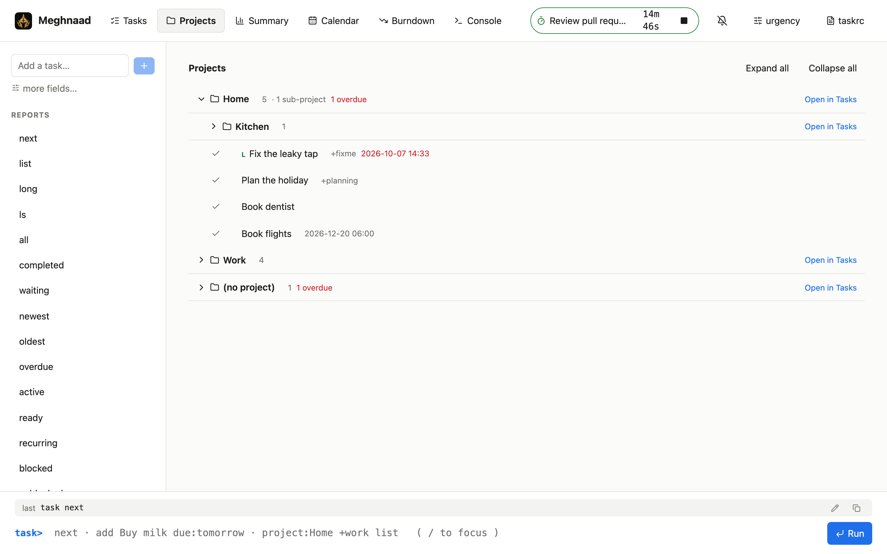
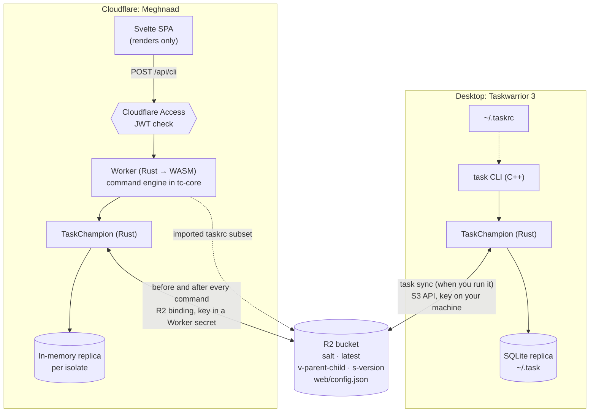

<p align="center">
  
</p>

<h1 align="center">Meghnaad</h1>

<p align="center">
  <a href="https://taskwarrior.org">Taskwarrior 3</a> in your browser. Runs on Cloudflare: a Rust Worker,
  your existing R2 bucket as the sync store, and Cloudflare Access for login.
</p>

---

Meghnaad is another **replica** of your Taskwarrior data. Your `task` CLI keeps syncing to R2 exactly as it does
today; this app reads and writes the same bucket, so a task added in the browser shows up on your laptop after
`task sync`, and the other way round. It is **console-first** (type `task`-style commands) with a normal UI beside
it (tables, forms, a detail view), and both go through the same command engine.

- **Works with the bucket you already have.** Point it at the R2 bucket your `task` already syncs to and give it
  the same encryption secret. No migration, no new server, nothing changes for the CLI.
- **Taskwarrior behaviour, not an imitation of it.** Filters, virtual tags (`+OVERDUE`), urgency, report sorting,
  UDAs and custom reports follow Taskwarrior's own rules, ported from its source.
- **Your `taskrc`, safely.** Import your UDAs, custom reports and contexts. Sync settings and anything that looks
  like a credential are deliberately blocked.
- **Time tracking** (`journal.time`), a sessions table per task, and reminders while the tab is open.

> **Status.** Verified end to end against the released `task` 3.5.0 using a local S3-compatible server (both
> directions: tasks, UDAs, custom reports, timed due dates). It has **not yet been run against a real R2 bucket**;
> see [Known limitations](#known-limitations).

## Screenshots

<p align="center">
  
</p>

<table>
  <tr>
    <td width="50%"></td>
    <td width="50%"></td>
  </tr>
  <tr>
    <td align="center"><sub>Projects, with sub-projects grouped under their parent (<code>Home.Kitchen</code> sits under <code>Home</code>)</sub></td>
    <td align="center"><sub>Task detail, with time tracking and annotations</sub></td>
  </tr>
  <tr>
    <td></td>
    <td align="center"></td>
  </tr>
  <tr>
    <td align="center"><sub>The console: type <code>task</code>-style commands</sub></td>
    <td align="center"><sub>On a phone</sub></td>
  </tr>
</table>

## Contents

[Screenshots](#screenshots) · [How it works](#how-it-works) · [Quick start (local)](#quick-start-local) · [Deploy to Cloudflare](#deploy-to-cloudflare) ·
[Connect your `task` CLI](#connect-your-task-cli) · [Using Meghnaad](#using-meghnaad) · [Configuration](#configuration-reference) ·
[Security](#security-notes) · [Development](#development) · [Troubleshooting](#troubleshooting) ·
[Known limitations](#known-limitations) · [About the name](#about-the-name) · [License](#license)

## How it works

```
 task CLI  ──(S3 API + your R2 token)──┐
                                        ▼
 Browser ── Cloudflare Access ──▶  Worker (Rust → WASM) ──(R2 binding)──▶  R2 bucket
   Svelte app ──  /api/cli  ──────▶   • checks the Access token            salt · latest
                                      • decrypts with your secret          v-<parent>-<child>
                                      • runs the command engine            s-<version>
                                      • syncs, then writes                 web/config.json
```

- The bucket holds Taskwarrior's standard **TaskChampion cloud layout** (`salt`, `latest`, `v-…`, `s-…`), encrypted
  client-side. The Worker implements the same protocol, so it and the CLI are interchangeable replicas.
- The Worker keeps an in-memory replica per instance and **syncs before and after every command**, so it only
  downloads versions it hasn't seen.
- One endpoint, `POST /api/cli`, takes `{ "line": "…" }` (the console) or `{ "args": […] }` (the UI), so there is a
  single place where Taskwarrior semantics live.
- Your imported `taskrc` settings are stored in the same bucket (`web/config.json`, plus one backup), so they
  survive restarts, redeploys and moving between devices.

### Compared with Taskwarrior on the desktop

Both are replicas of the same TaskChampion data, and the bucket is all they share. The desktop is a fat client with
a local database that syncs when you ask. Meghnaad is a thin client: the browser holds nothing, and the Worker's
replica syncs on every request.



| | Desktop | Meghnaad |
| --- | --- | --- |
| Local state | Persistent SQLite | In memory, rebuilt from the bucket when the instance is recycled |
| Sync | On `task sync` | Before and after every command |
| Offline | Works | Needs a connection |
| Encryption key | Only on your machine | In a Worker secret; the Worker decrypts |
| Snapshots and cleanup | Done by the CLI | Left to the CLI |
| Undo | TaskChampion undo, unsynced changes only | Rebuilt as inverse operations, kept in memory |
| Task ids | Local to that replica | Computed separately, so they differ from the desktop's |
| Hooks | `on-add`, `on-modify` | None |

## Quick start (local)

You can run everything on your machine without a Cloudflare account; wrangler simulates R2 locally.

**Prerequisites:** [Rust](https://rustup.rs) 1.91+ and Node.js 20+ (developed on 24). The build installs the
`wasm32-unknown-unknown` target and `worker-build` for you if they're missing.

```bash
git clone <this repo> && cd Meghnaad
npm install                      # one install covers the Worker tooling and the Svelte app (npm workspace)
cp .dev.vars.example .dev.vars   # local-only secret + Access bypass
npm run dev                      # builds the web app and the Worker, then serves everything
```

The first `npm run dev` compiles the Worker to WASM (about a minute on a recent laptop, longer on a slow machine);
after that it rebuilds when you edit `crates/`. Open **http://127.0.0.1:8787**.

**Hot-reloading UI** (optional): in a second terminal run `npm --prefix web run dev`. It serves the app with live
reload and proxies `/api` to the Worker on 8787. If Vite's default port 5173 is taken it picks the next free one;
set `API_URL=http://127.0.0.1:<port>` to point it at a different Worker.

**Try it with sample data** (a bucket with nothing in it is fine too):

```bash
./scripts/seed-dev.sh            # demo tasks, UDAs, custom reports, a context, journal.time
```

Local R2 data lives in `.wrangler/state`; delete that directory to start over. `DEV_AUTH_BYPASS=1` in `.dev.vars`
makes the local server skip the Cloudflare Access check, which is why you can use it without logging in.

## Deploy to Cloudflare

You need a Cloudflare account with R2 and Access (the free plans work). Routes A and C also need Node.js 20+ and
[Rust](https://rustup.rs) on your machine (the build compiles the Worker to WASM; the `wasm32-unknown-unknown` target
and `worker-build` are installed for you if missing). Route B builds on Cloudflare instead. Pick one way:

### A. Guided: `npm run setup` (recommended)

```bash
npm install
npm run setup
```

It checks your build tools (offering to install what's missing), logs you in with `wrangler login`, then asks for the
things that differ between people:

| Question | Notes |
| --- | --- |
| **R2 bucket** | Your **existing** sync bucket is used as is; a name that doesn't exist yet is created. Nothing in the bucket is changed |
| **Custom domain** | Optional, e.g. `tasks.example.com`. The domain must already be a zone on your Cloudflare account. Empty = the free `*.workers.dev` address. With a custom domain the `workers.dev` address is switched off |
| **Encryption secret** | The same value as `sync.encryption_secret` in your taskrc (new bucket? invent a strong passphrase and use it for the CLI too). Stored as a Worker secret |
| **Cloudflare Access** | It tells you exactly what to click (see below) and asks for the team domain and AUD tag, then deploys again |

Your answers are saved in `.deploy.vars` (git-ignored). Run **`npm run deploy`** whenever you update the code, or
`npm run setup` again to change something; both are safe to repeat. `npm run deploy -- --check` prints the exact
config that would be deployed. `npm run setup` asks for an optional `WORKER_NAME` (also settable in `.deploy.vars`) to run a second copy, and any of its keys
can be given as environment variables instead (handy in CI).

**You can stop after the first deploy.** Until Access is connected, the app refuses every request and shows a
**setup page** explaining what's left, with your hostname filled in. Nothing about your tasks is reachable.

**Connecting Access** (the one part that needs the dashboard, because the AUD tag only exists once the application does):

1. Cloudflare dashboard → **Access controls → Applications → Add an application → Self-hosted**.
2. Destination: your hostname (the custom domain if you set one, otherwise the `workers.dev` address).
3. Add an **Allow** policy with the selector **Emails** and your address. *One-time PIN* login works without setup.
4. Copy the application's **Application Audience (AUD) tag**. Your team domain, `https://<team>.cloudflareaccess.com`,
   is under Access controls → **Settings**.

Cloudflare Access signs people in; the Worker then **re-verifies the signed token on every API call** (signature,
issuer, audience, expiry), so your data stays protected even if someone finds a way around Access. Make the Access
application cover the **whole hostname**: the static app shell (HTML and JavaScript, nothing private) is served
without running the Worker, so Access is what guards it.

### B. From the dashboard (no terminal)

Fork this repo to your GitHub account, then in the Cloudflare dashboard: **Workers & Pages → Create → Import a
repository**. Set the build command to `node scripts/build.mjs` (the Rust and web parts) and leave the deploy command
as `npx wrangler deploy`. Before the first build, edit `wrangler.jsonc` in your fork if you need a different bucket
(`bucket_name`) or a custom domain (`routes`). Then open the deployed address: the setup page walks you through Access
and the two **Text variables** (`TEAM_DOMAIN`, `POLICY_AUD`) to add under *Settings → Variables and Secrets*; add
`TC_ENCRYPTION_SECRET` there as a **Secret**. (`keep_vars` is on, so redeploys don't remove what you added.)

There's also a **Deploy to Cloudflare** button flow (`https://deploy.workers.cloudflare.com/?url=<your public repo URL>`)
and `package.json` carries the descriptions it shows. **It hasn't been tried with this repo yet**, mainly because the
build needs the Rust toolchain; treat route B as the supported dashboard path until you have confirmed it.

### C. By hand

```bash
npx wrangler login
npx wrangler r2 bucket create <name>             # skip if the bucket exists
echo "R2_BUCKET=<name>" > .deploy.vars           # skip if it is the default, taskwarrior-sync
npm run deploy                                   # builds, then prints the URL (Access can't be connected before this)
npx wrangler secret put TC_ENCRYPTION_SECRET     # the same value as sync.encryption_secret
# create the Access application, add TEAM_DOMAIN=... and POLICY_AUD=... to .deploy.vars, then:
npm run deploy
```

`.deploy.vars` takes `R2_BUCKET`, `CUSTOM_DOMAIN`, `TEAM_DOMAIN`, `POLICY_AUD` and `WORKER_NAME`, one `KEY=value` per
line. The tracked `wrangler.jsonc` never needs editing: `npm run deploy` overlays these values into a git-ignored
`wrangler.deploy.jsonc`.

> **Heads-up:** after `wrangler r2 bucket create`, wrangler may offer to add the bucket to `wrangler.jsonc` as a *new*
> binding (named after the bucket, with `"remote": true`). Answer **no**, or delete it afterwards: the app uses exactly
> one binding, `TASKS`, and `wrangler dev` refuses to start with an extra remote binding unless you've registered a
> workers.dev subdomain. (`npm run dev` runs in local mode, so it ignores remote bindings either way.)

**Last step, whichever way:** open the URL, sign in, and import your `taskrc` (the **taskrc** button) to get your UDAs
and custom reports.

## Connect your `task` CLI

Skip this if your CLI already syncs to the bucket. Otherwise create an **R2 API token** (R2 → *Manage R2 API Tokens*
→ **Object Read & Write**, scoped to your bucket) and note your account ID, then:

```bash
task config sync.encryption_secret '<the same value as TC_ENCRYPTION_SECRET>'
task config sync.aws.region        auto
task config sync.aws.bucket        <your bucket name>
task config sync.aws.access_key_id     <R2 access key id>
task config sync.aws.secret_access_key <R2 secret access key>

export AWS_ENDPOINT_URL=https://<ACCOUNT_ID>.r2.cloudflarestorage.com   # add to your shell profile
task sync
```

Released versions of Taskwarrior have no config key for a custom S3 endpoint, but the AWS SDK it uses reads
`AWS_ENDPOINT_URL` from the environment, which is what points it at R2. It must be set **everywhere `task sync` runs**
(your shell, cron, hooks, GUI launchers); otherwise `task` quietly talks to real AWS and fails with a
`PermanentRedirect` error. Newer, unreleased Taskwarrior builds add `sync.aws.endpoint_url`.

## Using Meghnaad

Two views over one engine: **Tasks** (a table with filters) and **Console**. A bar at the bottom is the prompt in
both, with the **last command** shown above it. That line follows the UI too: pick a report or click a table header
and you can see the exact command it ran, then press **↑** to edit and re-run it.

### Console

Commands follow Taskwarrior: `[filter] command [modifications]`, and the leading `task` is optional.

```
next                                   # a report (built-in, or defined in your taskrc)
project:Home +errand due.before:eow list
add Pay rent project:Home due:eom +bills
3 modify due:2026-12-25T08:30 priority:H
3 start        3 stop        3 done        3 delete        undo
3 annotate called the landlord
estimate:big count                     # UDAs work like any attribute
rc.report.next.sort:due-,project+ next # per-command overrides, as in Taskwarrior
help
```

| | |
| --- | --- |
| **Write** | `add` `modify` `done` `delete` `start` `stop` `annotate` `denotate` `append` `prepend` `undo` |
| **Read** | `info` `count` `projects` `tags` `udas` `columns` `reports` `contexts` `show` `export` `ids` `uuids` |
| **Filters** | `attr:value`, with modifiers `.is .not .has .startswith .before .after .by .none .any …`; `+tag` / `-tag`; virtual tags (`+OVERDUE +DUETODAY +READY +ACTIVE +BLOCKED …`); `/text/`; ids (`3`, `1-4,7`) and uuid prefixes; `and` `or` `not` and parentheses |
| **Dates** | `today tomorrow eow som eoy monday 3d 2w`, `2026-12-25`, `2026-12-25T08:30`, `now+2h` |

Notes that differ from Taskwarrior on a desktop:

- **Numeric ids are specific to this app** (pending tasks numbered by creation time). They won't match your laptop's.
  Use uuid prefixes where it matters.
- A command that would change several tasks asks you to confirm first.
- `undo` works on the last few commands made in this session of the Worker; it is forgotten when the Worker is
  recycled.

**Keys:** `/` focuses the prompt · `Tab` completes (and cycles a menu; `Shift+Tab` goes back) · `↑`/`↓` the last 20
commands · `Esc` closes a menu · `Ctrl+L` clears.

### Tasks view

- Pick any report (including your own) and add filters by typing, with Tab completion, or from the helpers. Filters
  show as removable chips.
- **Click a column header to sort** (again to reverse, a third time to reset, Shift-click to add a tie-breaker). The
  sort is applied as `rc.report.<name>.sort:…`, so it matches what you would type in the console.
- **Click a row** for the detail view: all fields, annotations, dependencies you can follow, and (with
  `journal.time`) a table of work sessions. Row buttons: done, start/stop, edit, delete.
- **Add tasks** from the sidebar. *More fields…* opens the full form: project, priority, due/wait/scheduled/until,
  tags, dependencies, UDAs, "start now", and a first note.
- Every **date field takes a date and an optional time**. Leave the time empty for a whole day.
- **Dates are shown the way your taskrc says**: `dateformat`, `dateformat.report` (tables), `dateformat.info` (detail
  view), `dateformat.annotation` (notes) and a report's own `report.<name>.dateformat`, with Taskwarrior's fallbacks and
  tokens (`Y y M m D d H h N n S s A a B b V v J j w`, e.g. `dateformat=D/M/Y`, `dateformat.info=A, d B Y H:N`).
  Without one, dates show as `2026-12-25` plus the time only when there is one. Column styles such as `due.relative` or
  `due.epoch` are unaffected.

### Your taskrc

UDAs, custom reports and contexts live in `~/.taskrc`, not in your synced data, so the app keeps its own copy. Open
**taskrc**, paste or choose your file, and save. Only these are kept: `uda.*`, `report.*`, `context*`, `urgency.*`,
`journal.*`, `recurrence*`, `default.command`, `due`, `weekstart`, `dateformat*`.

- **Sync settings and anything credential-like are blocked** (`sync.*`, `taskd.*`, names containing `secret`,
  `password`, `token`, …). Only the *names* of what was dropped are shown. The raw text is never stored.
- What is saved is shown back to you, so each import edits it rather than replacing it with a blank page. **Restore
  previous** undoes the last save.
- `include` lines can't be followed; paste the included files' contents too.
- A UDA that exists on a task but isn't defined in your taskrc is shown but **read-only**.
- **[taskrc support](docs/taskrc-support.md)** lists every Taskwarrior `taskrc` option with what is done, what is
  partial, what is not done, and why.

### Urgency

A task's urgency is the sum of Taskwarrior's `urgency.*` terms, with its built-in coefficients unless your taskrc
changes them. Open **urgency** to see every coefficient next to its default, edit it, add your own, or send one
back to its default. Edits are saved with the rest of your imported settings (as `urgency.*` lines in the
**taskrc** dialog), so they survive restarts and **Restore previous** covers them. Your desktop `~/.taskrc` is not
touched, so copy any change you want there.

It follows Taskwarrior's rules, so nothing is inherited that Taskwarrior doesn't inherit:

- **Coefficients add up.** A task gets every matching coefficient, not just the most specific one.
- **Projects reach their sub-projects.** `urgency.user.project.Home.coefficient` applies to `Home` and `Home.Kitchen`,
  but not to `Homework`.
- **Tags** match user tags and virtual tags (`urgency.user.tag.OVERDUE.coefficient`). **Keywords** match the
  description (case-sensitive). `urgency.uda.<name>.coefficient` matches any value of a UDA and
  `urgency.uda.<name>.<value>.coefficient` one value.
- **`urgency.inherit` is off**, as in Taskwarrior. When you turn it on, a task that blocks others takes the highest
  urgency of the tasks it blocks, through the whole chain, plus 0.01 so it sorts above them.

`task rc.urgency.due.coefficient:0 next` and `rc.urgency.inherit:1` also work for a single command in the console.

### Recurring tasks

Add one with `recur:` and a `due` date, in the console or with the **Repeat** field of the form:

```
add Water plants recur:weekly due:friday
add Pay rent recur:monthly due:eom until:2027-12-31
3 modify recur:2w                      # change the period of a recurring task
```

Periods are Taskwarrior's: `daily` `weekdays` `weekly` `biweekly` `monthly` `quarterly` `yearly`, counts such as
`3d` `2w` `6mo`, and ISO durations like `P1M`. The first instance has the `due` you gave; later ones follow the period.
A repeating task shows a **repeat icon**; its detail view lists its instances, and an instance links back to it.

- **The web app only creates instances when your taskrc says `recurrence=on`** (add it under **taskrc**; optional
  `recurrence.limit=N` keeps N upcoming instances, default 1). Taskwarrior itself defaults to *on*, and two replicas that
  both create instances while out of sync make duplicates, so if your desktop `task` already does this, leave it off
  here. Either way the web app shows and edits recurring tasks, and reads instances made elsewhere. With it on, instances
  are created, finished series retired and `until` honoured before each command, as in Taskwarrior. (Both can safely
  run side by side: instances are numbered the same way, so a second replica finds nothing missing.)
- The recurring task itself is a template: you can edit it but not complete or start it.
- **Editing one task of a series** (the template, or one of its instances) follows `recurrence.confirmation`, as in
  Taskwarrior: `prompt` (the default) asks whether to change **all pending recurrences** or **only this task**; `yes`
  always changes the whole series; `no` only the task you edited. Descriptive changes (description, project, priority,
  tags, UDAs, ...) are shared; dates and the period itself stay per task, so moving one instance never moves the others.
  In the console the question has three buttons; in the form it is a browser prompt.
- Deleting a recurring task asks first, because it deletes its open instances too.
- `recurrence.indicator` (default `R`) is what the `recur.indicator` column shows.

### On a phone

The layout adapts below ~760px wide: the report list moves into a menu (☰), tasks become cards with big buttons, the
header sort becomes a **Sort** picker, forms and the detail view go full screen, and a **+** button adds a task.
The prompt gets **Complete** (⇥) and **Previous command** (⌃) buttons since there's no Tab or arrow key, and
completions can be tapped. Install it to your home screen from the browser menu if you like.

### Time tracking and reminders

- Add `journal.time=on` to your taskrc. `start` and `stop` then record "Started task" / "Stopped task" (the texts are
  configurable), and the detail view shows a sessions table with a running total. A running task shows a timer in
  the header and tab title.
- The **bell** turns on reminders: a heads-up before a timed due date, a morning reminder for dates without a time,
  tasks coming off `wait`, and one digest per day for what's already overdue. Reminders need the **tab to be open**
  (the app can't wake up in the background), and system notifications need HTTPS or `localhost` plus your permission.

## Configuration reference

| Name | Kind | Purpose |
| --- | --- | --- |
| `TASKS` | R2 binding (`wrangler.jsonc`) | The bucket your `task` CLI syncs to |
| `TC_ENCRYPTION_SECRET` | Worker secret | Same value as the CLI's `sync.encryption_secret` |
| `TEAM_DOMAIN` | var (not in `wrangler.jsonc`) | `https://<team>.cloudflareaccess.com`. Set by `npm run setup` (via `.deploy.vars`) or as a Text variable in the dashboard |
| `POLICY_AUD` | var (not in `wrangler.jsonc`) | The Access application's AUD tag; same two ways |
| `R2_BUCKET`, `CUSTOM_DOMAIN`, `WORKER_NAME` | `.deploy.vars` | Optional deploy choices; see *Deploy to Cloudflare* |
| `DEV_AUTH_BYPASS` | `.dev.vars` only | Skips the Access check for local development. It is only honoured for loopback hosts (`localhost`, `127.x.x.x`, `::1`); on any other host it is ignored and logged. Still: never set it on a deployed Worker |

## Security notes

- **Login** is Cloudflare Access. The Worker independently validates the `Cf-Access-Jwt-Assertion` token on every
  `/api/*` request: RS256 signature against your team's published keys, issuer, audience, expiry, and not-before.
  It refuses `alg: none`, algorithm-confusion tokens, unknown keys, and a token supplied only in a cookie.
  `npm run test:auth` proves this by minting good and forged tokens against a mock Access (see
  [Development](#development)).
- **Closed by default:** misconfiguration (placeholder team/audience, unreachable keys) means `403`, never open.
- **Cross-site requests:** writes whose `Origin` isn't this site are refused, API responses are `no-store`, and the app
  shell is served with a strict Content-Security-Policy (`web/public/_headers`).
- **Encryption:** the CLI and the Worker use TaskChampion's scheme (PBKDF2-HMAC-SHA256 → ChaCha20-Poly1305). The
  Worker holds the secret to decrypt on your behalf, which is a deliberate trade-off: whoever can read Worker
  secrets in your Cloudflare account can read your tasks. It is not end-to-end encrypted from Cloudflare.
- The R2 token on your machines (for the CLI) is separate from the Worker, which uses a binding and holds no token.
- The taskrc importer never stores, logs or returns sync/credential values; there are tests that feed it a file full
  of secrets and assert none appear anywhere.

## Development

```
crates/tc-core/   protocol, crypto, filter/report/urgency engine, command parser, taskrc  (pure Rust)
crates/worker/    the Cloudflare Worker: routes, Access check, R2 store, session cache
web/              the Svelte 5 app (Vite)
scripts/          setup.mjs / deploy.mjs (guided and repeat deploys) · build.mjs (web + Worker build) ·
                  seed-dev.sh (demo data) · interop-local.sh (real-CLI regression)
assets/           the logo master
```

```bash
npm test                      # cargo test + the web unit tests + the deploy-script tests
npm run check                 # svelte-check (types, accessibility)
npm run test:auth             # Cloudflare Access: forged, expired, wrong-audience tokens... all refused
./scripts/interop-local.sh    # real `task` ⇄ the Worker, both directions
```

`test:auth` needs only Node and a built Worker (`cd crates/worker && worker-build --release`). It starts a mock
Access, runs the Worker with the dev bypass off, and checks a matrix of ~30 requests.

`interop-local.sh` (tasks, UDAs, reports, recurring series) needs `task`, the `aws` CLI, `sqlite3`, a built Worker, and a local S3-compatible server that
enforces conditional writes, for example
`docker run -d --name tw-s3 -p 18333:8333 chrislusf/seaweedfs server -s3 -dir=/data`. It is self-contained (own port,
own storage) and does not touch a dev server you have running.

Taskwarrior's behaviour is ported from its source (`sort.cpp`, `Task.cpp`, `CLI2.cpp`) and checked by tests, so when
changing filters, sorting, urgency or journalling, read the C++ first.

## Troubleshooting

| Symptom | Likely cause |
| --- | --- |
| The app shows an "Almost there" page | Access isn't connected yet: follow the page, or `npm run setup` |
| `403` from `/api/*` after deploying | `TEAM_DOMAIN` / `POLICY_AUD` not set or wrong (the `iss`/`aud` of the token must match them exactly), or you're not signed in through Access. The Worker log says why (`auth rejected: …`) |
| "task storage error" (502) | Wrong `TC_ENCRYPTION_SECRET` or the wrong bucket. The cached state resets on the next request |
| `wrangler dev` says the assets directory is missing | Run `npm --prefix web run build` once |
| `wrangler dev` exits with "register a workers.dev subdomain" | `wrangler.jsonc` has an extra `"remote": true` R2 binding (added when you ran `wrangler r2 bucket create`). Delete it, keeping only `TASKS`. `npm run dev` already runs in local mode and ignores it |
| `task sync` fails with `PermanentRedirect` | `AWS_ENDPOINT_URL` isn't set in that environment, so it's talking to AWS |
| Banner: "saved taskrc settings couldn't be read" | The stored settings are corrupt; nothing was deleted. Open **taskrc** and save again (the unreadable copy is kept aside) |
| Reminders never appear | The tab must be open; the page needs HTTPS or `localhost`; check the browser's notification permission |
| Vite starts on another port | 5173 is in use; that's fine, use the port it prints |
| "the server is busy; try again" | Many commands arrived at once and waited too long for the shared replica; retry |

## Known limitations

- **Not yet tested against real R2.** The CLI's own use of R2's conditional writes is a good sign, but run a
  `task sync` and a web edit against a scratch bucket before trusting it with data you can't lose.
- **Recurring tasks** follow Taskwarrior's rules and were checked against real `task` 3.5.0 in both directions, but the web app only creates instances when the taskrc has `recurrence=on` (see above).
- **Phone layout** was verified in an emulated phone browser (touch, 390px); try it on your own device before relying on it, in particular the on-screen keyboard and safe-area insets.
- **Snapshots and cleanup** of old versions are left to the CLI.
- **Dates you type** aren't parsed with your `dateformat`: use `2026-12-25`, `2026-12-25T08:30` or words like `friday`, `3d`. (Dates *shown* follow it; see Tasks view.)
- **Not every `taskrc` option is supported.** Terminal, colour and local-file options don't apply to a web app, and some
  (`default.project`, `alias.*`, `context.<name>.rc.*`, …) aren't implemented yet. See [taskrc support](docs/taskrc-support.md).
- Single user: one set of settings and one shared replica per Worker instance.

## About the name

<p align="center">
  
</p>

Meghnaad is the warrior of the Ramayana who fought from behind the clouds. This app is Taskwarrior (the warrior)
running on Cloudflare (the cloud), with Cloudflare Access as the cover.

## License

[MIT](LICENSE) © 2026 Utsob Roy
