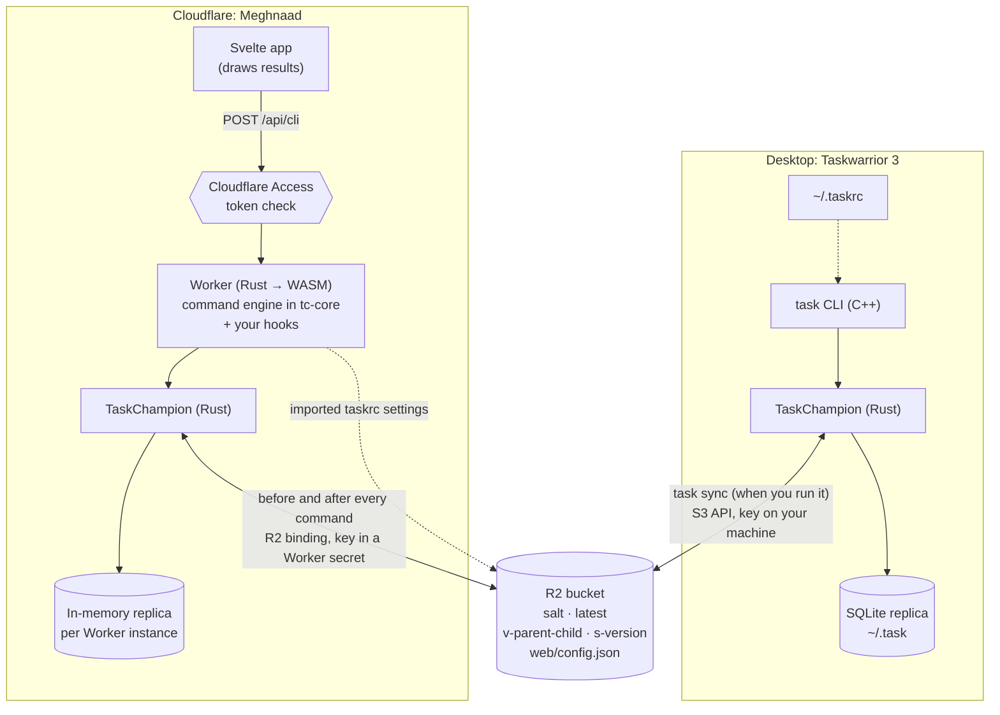

# Architecture

How Meghnaad is put together, and why. For what it does, see [Using Meghnaad](using.md); for the
settings it reads, [taskrc support](taskrc-support.md).

## The idea

Taskwarrior 3 keeps its data in **TaskChampion**, which syncs through a *server*: a place where every client
pushes its changes (as numbered "versions") and pulls everyone else's. With `sync.server.type=aws` that place is a
bucket, and the clients agree on its layout. Meghnaad is one more client of that bucket, written for the browser:

- It is a **replica** like your laptop's, not a copy of the database. It reads and writes the same bucket, speaking
  TaskChampion's own format and encryption, so `task sync` and the web app see each other's changes.
- The browser holds no tasks. A Cloudflare **Worker** holds an in-memory replica, and the browser asks it to run
  Taskwarrior commands and shows what comes back.
- Everything that is *Taskwarrior behaviour* (filters, reports, urgency, recurrence, confirmations, dates) lives in
  one Rust library, `tc-core`. The browser does layout, not logic.

## The request path

Every action goes through one endpoint, `POST /api/cli`, with `{ "line": "…" }` (what you typed in the console) or
`{ "args": […] }` (what a button sends). One endpoint means one place where Taskwarrior semantics live. The one
exception is `POST /api/import`, which takes the *text of a file* (a command line can't carry one): the browser reads the
file and sends it as it is, and `tc-core`'s `import` module parses and checks it, so the rules are still only in Rust.
`?apply=1` writes it; without that it only reports what it would do.

1. **Static files** (the app shell) are served by Cloudflare without running the Worker. Only `/api/*` runs it.
2. **`auth.rs`** checks the Cloudflare Access token on every `/api/*` request: RS256 signature against your team's
   published keys, issuer, audience, expiry. Misconfiguration means `403`, never open.
3. **`session.rs`** holds what a Worker instance ("isolate") keeps between requests: the derived key, a long-lived
   replica, the undo stack and the imported taskrc. A cold instance builds these; a warm one reuses them.
4. **Sync, run, sync.** The Worker pulls versions it hasn't seen, runs the command against the replica, and if
   anything changed pushes it before answering. With nothing new, a sync is one read of `latest`.
5. **`tc-core::cli::execute`** parses and runs the command and returns a `CliResult` (a report, a table, a calendar,
   a question, an error…), which is serialised as JSON.

## `tc-core`: the engine

Pure Rust, no I/O of its own, tested natively. The Worker and the tests are two hosts for it.

| Area | Modules | What they do |
| --- | --- | --- |
| **Protocol** | `cloud`, `crypto`, `names`, `store` | TaskChampion's cloud server over an object store; PBKDF2 → ChaCha20-Poly1305; object names; the storage trait the Worker implements over R2 |
| **Replica storage** | `live` | The replica's in-memory database. TaskChampion's own copies every task on the first write of each transaction, so every sync and every write cost a full copy (and twice the memory for a moment); this one changes its data in place and keeps a short journal to undo a transaction that is dropped without commit. A test runs random transactions against both and compares them |
| **Tasks** | `model`, `filter`, `modify`, `dates`, `rx`, `recur` | A plain view of a task; filter expressions; planning `modify`/`add`; Taskwarrior's date and duration parsing; Taskwarrior's regular expressions; recurring tasks |
| **Commands** | `cli` | Parsing a command line (aliases, abbreviations, contexts, `rc.` overrides), the write path with its confirmations (`add`, `log`, `duplicate`, `modify`, …), undo, the `commands` listing, and dispatch to everything below |
| **Reports** | `report`, `run`, `urgency`, `history` | Built-in and custom reports, running one (filter, sort, limit, columns), urgency, and the change history of a task |
| **Colour** | `color` | Taskwarrior's colour specifications and how they blend, the rules that colour a task (with precedence and merge), the `colors` command and the history graph's colours; checked against the escape codes of the real `task` |
| **Views** | `summary`, `calendar`, `burndown`, `activity`, `stats`, `calc`, `export`, `import` | The `summary`, `calendar`, `burndown.*`, `history.*`/`ghistory.*`/`timesheet` (`activity`), `stats`, `calc` (and `_get`, which reads the same DOM) and `export` commands, each a port of its Taskwarrior counterpart. `export` writes Taskwarrior's own JSON from the stored properties; `import` reads it back (a port of `CmdImport`, checking the whole file before it writes anything); the app's pages use a separate, hidden `_rows`, and the detail view's History a hidden `_history <uuid>` that reads one task's operations without loading the rest |
| **Hooks** | `hooks`, `my_hooks` | `hooks` runs your own Rust at Taskwarrior's four hook points (`on_launch`, `on_add`, `on_modify`, `on_exit`): compiled into the Worker, fed a task and handing one back, with what they print returned to the Console; `my_hooks` is the one file you edit, kept apart so upstream updates rarely touch it |
| **Settings** | `taskrc`, `rc_url`, `settings` | The allowlisted subset of a taskrc: what is accepted, what is refused, and the typed `Config` the rest reads; `rc_url` is which links the Worker may fetch a taskrc from (HTTPS to a public host name only, redirects included) and the GitHub/GitLab page-to-raw rewrite; and the `show` / `config` / `context` commands that list and edit it under the same rules (`context` is a few `context.<name>.*` settings, edited through `config`) |

### How a command runs

`execute` does the same things in the same order every time:

1. Apply the command line's `rc.<key>:<value>` overrides to a copy of the config, then the active context's own
   settings (which win, as in Taskwarrior).
2. Read the first day of the week, `date.iso` and `dateformat` into the clock, and expand aliases (typed lines only).
3. Parse into a filter, a command and modifications. A word shorter than `abbreviation.minimum` is just a word.
4. Run the `on_launch` hook, which can refuse the command (`show`, `config` and `context` skip it: they are about settings).
5. Do Taskwarrior's housekeeping first: create the recurring instances that are due, expire tasks past `until`.
6. Load the tasks as plain "facts", number the pending ones, and run the command. `on_add` and `on_modify` fire inside
   it, just before a write is committed.
7. Run the `on_exit` hook, and return what the hooks printed with the result (`feedback`), for the Console to show.

Writes go through one path (`write_selected`) so the safety rules are in one place:

- **Questions are data, not prompts.** A write that needs an answer returns a `Confirm` result and changes
  nothing. There are three kinds: `plain` (yes/no: undo, a command with no filter), `permission` (one row per task
  the command would change: Taskwarrior's yes/no/all/quit becomes ticks in a table) and `extras` (follow-ups that
  only arise once those are answered: repair a dependency chain, carry a change to a recurring series). The client
  re-sends the command with the answers (`Options { confirmed, approved, extras }`).
- **Hooks** run inside this path, before the commit: `on_add` and `on_modify` see the task as the command leaves it, and what they hand back is diffed and applied into the same batch, or the command is refused and nothing is saved.
- Everything the command changes is built as one batch of operations and committed once, so it is one undo step.
- Undo can't use TaskChampion's own (it only covers unsynced changes, and the Worker syncs after every write), so
  the inverse operations are committed as new changes. The stack lives in the isolate's memory.

### Sync

`CloudServer` is TaskChampion's server interface over the bucket, wire-compatible with the CLI's own AWS/GCP
backends (`salt`, `latest`, `v-<parent>-<child>`, `s-<version>`; encrypted with a key from your secret and the
bucket's salt). Because the Worker is a *replica*, it never needs the CLI's cooperation.

- **Cheap when idle.** One `GET latest`. Catching up lists the versions once and fetches them in batches of 32,
  rather than one at a time.
- **Conditional writes.** `latest` is swapped with its ETag, so two clients pushing at once can't both win; the loser
  re-syncs and retries.
- **Snapshots, like the CLI.** After a push the Worker occasionally (about one push in ten) writes a snapshot and
  removes the ones it supersedes, so a cold start restores one snapshot plus a few versions instead of replaying
  history. A failed snapshot is ignored on purpose: failing the sync would make the replica send an already-sent
  version again.
- **Tidying up, like the CLI.** About one push in twenty is followed by a cleanup, as in TaskChampion's own server:
  it deletes versions that lost a race (but not one a writer may be about to make `latest`), every snapshot but the
  newest, and versions older than about 180 days that the newest snapshot covers. It uses each object's upload time from
  R2's listing and deletes up to 1,000 objects per cleanup in a single request (R2 takes that many at once), so a
  cleanup costs a handful of requests however much it removes; the next one carries on. The oldest versions go first,
  so what is left is always one unbroken chain up to `latest` (a replica that is behind finds the next version or none,
  never a gap). A failure is ignored, since the push it follows has already happened. A replica that was last synced
  before the oldest surviving version can no longer catch up from the versions alone, which is the same for the CLI's
  own server.

## Limits of the platform

A Worker request has hard limits, and this app is shaped by them. Cloudflare's numbers (checked at their limits page):

| | Workers Free | Workers Paid |
| --- | --- | --- |
| CPU time per request | **10 ms** | 30 s (up to 5 min) |
| Memory per isolate | 128 MB | 128 MB |
| Subrequests per request (R2 calls count) | 50 | 10,000 |

What this app costs, measured (`crates/tc-core/tests/memory.rs`, and a local `workerd`):

- **The key.** Deriving it (PBKDF2, 600,000 rounds) is the heaviest thing a *cold* instance does. The Worker asks the
  runtime's native Web Crypto for it, which takes about 40 ms; the same in WebAssembly took about 250 ms. A warm
  instance reuses it.
- **A warm request** is a few milliseconds of CPU for a hundred tasks and tens for thousands (filtering, sorting,
  urgency, serialising).
- **Memory** is small: restoring a snapshot of 3,000 tasks peaks near 6 MB, replaying 1,200 versions from nothing near
  6 MB, and a request over 3,000 tasks 8 MB (19 MB for a full `export`). An `import` of the most one takes (5,000
  tasks, a 2 MB file) peaks near 51 MB, and its `undo` step keeps about 8 MB while the instance lives, which is why the
  request is capped. The test fails if a change makes any of these much worse.

So the free plan's 10 ms CPU limit is below what the first request after an idle spell needs, and **the Worker needs
the Workers Paid plan** (R2 and Access are fine on free). The app retries a read-only request once if Cloudflare cuts
it off with error 1102, because the retry meets a warm instance.

## The web app

A Svelte 5 single-page app (`web/`), built with Vite and served as static assets.

- `store.svelte.ts` is the one store: the current page, the config, the console's entries, the live report, the
  answers to questions in flight, and the toast.
- **Pages** (`TasksView`, `ProjectsView`, `TagsView`, `SummaryPage`, `CalendarPage`, `BurndownPage`, `ConsoleView`) are thin. Each
  asks the engine for a result and hands it to a shared component, so the console and the pages draw the same thing.
- Colours: the engine sends each row's colour as palette indexes (`Row.style`) and the chart colours with the config;
  `colors.ts` draws them (the soft basic sixteen per light/dark page, exact xterm colours otherwise, a contrast guard),
  `scheme.svelte.ts` says which page it is, and `themes.ts` and the taskrc dialog's picker put a bundled theme's lines
  into the taskrc (the theme files are static assets).
- `ResultView` turns any `CliResult` into UI: `ReportTable`, `SummaryView`, `CalendarView`, `BurndownView`,
  `TaskInfo`, `ConfirmView`, and the lines hooks printed under the result (a toast when a button, not the console, ran the command). A report's cells are formatted in `format.ts`, the one place that knows `dateformat`,
  indicators and urgency colours.
- **Bulk actions** (`BulkBar`, `BulkModify`, `selection.svelte.ts`, `bulk.ts`): the table's checkboxes feed one selection; the bar sends ordinary commands (the whole uuids of the ticked tasks side by side, which Taskwarrior reads as one group, then `done`, `delete` or `modify` with the words the editor made), so the engine needs nothing of its own. **Command** hands the prompt a line through `store.requestPrompt`.
- **Task addresses**: `route.ts` maps a task to `/task/<8 characters of its uuid>` and back; `App.svelte` keeps the address bar and the drawer in step (opening pushes an address, closing or Back leaves it), and `store.openFromAddress` finds the task with `uuid.startswith:<prefix> uuids`. `DepLink` is the id of another task (a dependency, a parent) with a hover, focus or tap card; in the drawer `DepItem` is a line that expands to the same `TaskCard`, and the tasks that wait on this one are looked up with `depends.has:<uuid>` only when asked. A project part or a tag chip jumps to its entry on the Projects or Tags page (`store.showProject` / `showTag`).
- The filter box (`FilterInput`, `FilterChips`) and the prompt share `completion.ts`; both feed the same engine.
- The browser stores nothing but small conveniences (command history, reminder settings). Settings live in the bucket
  (`web/config.json`, with one backup).

## How correctness is kept

The goal is Taskwarrior's behaviour, not a lookalike, so the method is to **read the C++, port it, and check it
against the real `task` 3.5.0**: run both on a scratch data directory and compare. Examples: calendar layouts and week
numbers, burndown charts bar by bar, `summary`/`projects`/`tags` output, `calc` results, confirmation prompts, the
dates each `date.iso`/`dateformat` combination accepts.

| Layer | What it proves |
| --- | --- |
| `cargo test` (unit) | Each port against fixtures taken from the real `task` |
| `tests/cli_exec.rs` | Real command lines against a real replica: writes, reports, confirmations, recurrence, calc, `show`/`config`, hooks (injected through `Options.hooks`) |
| `tests/sync_cost.rs`, `replica_sync.rs` | R2 call counts per sync; two replicas converging |
| `tests/memory.rs` | Peak memory of a cold start and of requests |
| `npm --prefix web test` | The browser-side logic: formatting, completion, the store, the API client |
| `scripts/interop-local.sh` | The real `task` CLI and the Worker against one local S3 bucket, both directions: tasks, UDAs, recurring series, snapshots |
| `scripts/auth-check.mjs` | Forged, expired and wrong-audience Access tokens are all refused |
